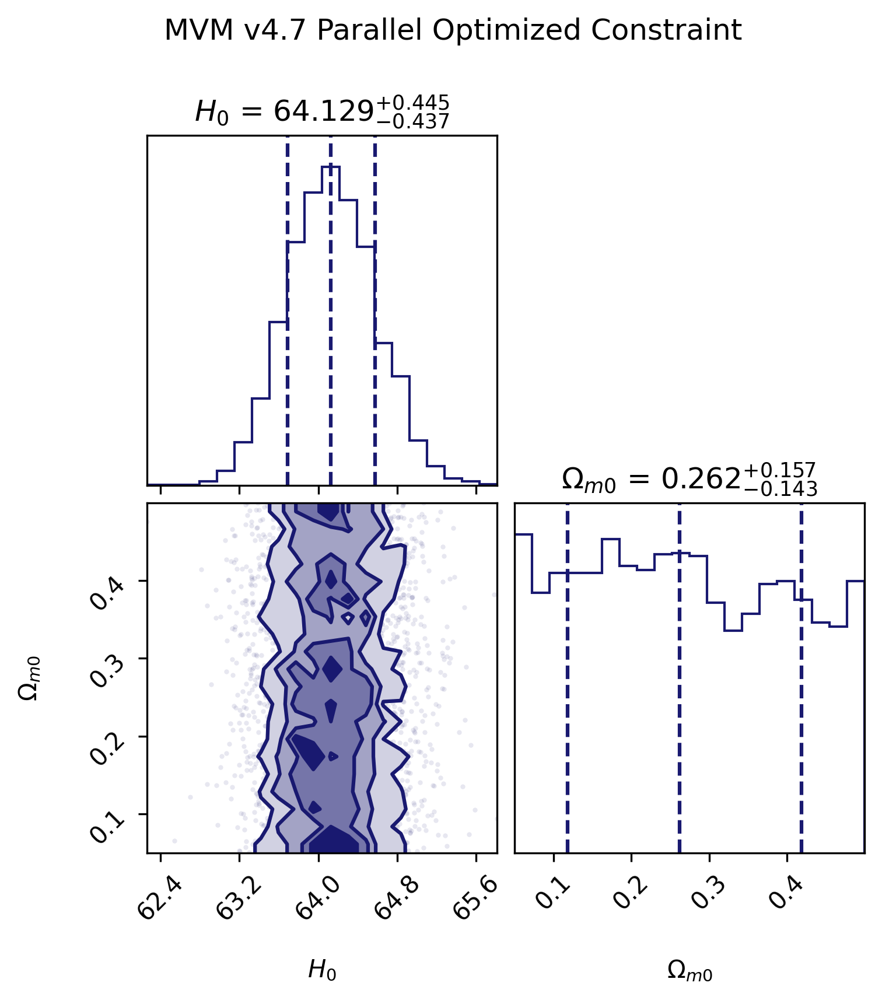
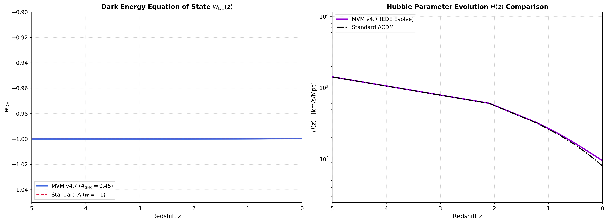

# MVM v4.7 集成生产环境 (MVM v4.7 Integrated Production Environment)

## 项目简介

本仓库提供了 MVM (Modified Visser Model) v4.7 宇宙学模型的全集成生产环境。它结合了先进的物理引擎、自动化的观测数据加载、高效的似然优化方法，以及科学级的数据可视化工具。本模型旨在探索超越标准 $\Lambda$CDM 模型的宇宙演化动力学，特别关注早期暗能量 (EDE) 及其对宇宙膨胀历史的影响。

### 核心特色：

*   **MVM v4.7 物理引擎**：采用高精度 Radau ODE 求解器，精确模拟背景宇宙的演化，包括暗能量、辐射和物质组分。
*   **数据自动化加载**：集成 Pantheon+ 超新星数据与 DESI 2024 BAO 最新观测数据，确保模型与最前沿的宇宙学观测紧密结合。
*   **高性能似然优化**：通过预计算积分表和 $M_B$ 解析边缘化似然技术，显著提升了马尔可夫链蒙特卡洛 (MCMC) 采样的效率。
*   **科学可视化**：利用 `emcee` 和 `corner` 库生成高质量的 Corner Plot，展示模型参数的联合约束，并输出矢量 PDF 格式，满足学术论文发表要求。

## 物理模型公式

MVM v4.7 模型通过以下方程描述宇宙动力学：

### 暗能量状态方程 $w_{\mathrm{DE}}(z)$

暗能量的状态方程 $w_{\mathrm{DE}}(z)$ 是 redshift $z$ 的函数，其演化对于理解暗能量的性质至关重要。模型通过求解背景演化方程来获得 $w_{\mathrm{DE}}(z)$ 的历史。

### 势能项与耦合项

模型的复杂动力学由多个标量场及其相互作用的势能定义。主要的势能项和耦合项包括：

*   **标量场 $\phi$ 的指数势能**：
    $V_{\phi} = V_0 \exp(-\lambda_{\phi} \phi)$

*   **标量场 $\sigma$ 的四次势能**：
    $V_{\sigma} = rac{1}{4} \lambda_{\sigma} (\sigma^2 - v_{\mathrm{vev}}^2)^2$

*   **标量场之间的相互作用势能**：
    $V_{\mathrm{interaction}} = rac{1}{2} g_{\mathrm{scale}} (\sigma^2) (\phi^2) (\chi^2)$

其中，$V_0$, $\lambda_{\phi}$, $\lambda_{\sigma}$, $v_{\mathrm{vev}}$, $g_{\mathrm{scale}}$ 为模型的自由参数。

## 主要结论图表

### MVM v4.7 参数联合约束 (Corner Plot)



这张 Corner Plot 展示了 MVM v4.7 模型的关键宇宙学参数 $H_0$ 和 $\Omega_{m0}$ 的联合约束。图中显示了参数的边缘化概率分布、互相关性以及最佳拟合值。

### Hubble 参数 $H(z)$ 演化对比



这张图对比了 MVM v4.7 模型（蓝色曲线）与标准 $\Lambda$CDM 模型（虚线）在不同红移 $z$ 下的 Hubble 参数 $H(z)$ 演化。它突出了 MVM 模型在早期宇宙膨胀历史中可能存在的偏差或独特特征。

## 快速运行指南

您可以按照以下步骤在 Google Colab 或本地环境中运行此项目：

1.  **克隆仓库**：
    ```bash
    git clone https://github.com/jiangzefeng2322-ship-it/MVM-v4.7.git
    cd MVM-v4.7
    ```

2.  **安装依赖**：
    在您的 Python 环境中安装必要的库：
    ```bash
    pip install numpy pandas matplotlib scipy emcee corner requests
    ```

3.  **运行 Jupyter Notebook**：
    打开 `Untitled.ipynb`（请根据实际文件名调整）并在 Jupyter 环境中运行所有单元格。该 Notebook 将自动执行物理模型、加载数据、进行 MCMC 采样并生成图表。

    ```bash
    jupyter notebook Untitled.ipynb
    ```

4.  **查看结果**：
    运行完成后，生成的 PNG 和 PDF 格式的图表将保存在当前目录下和 `images/` 文件夹中。
